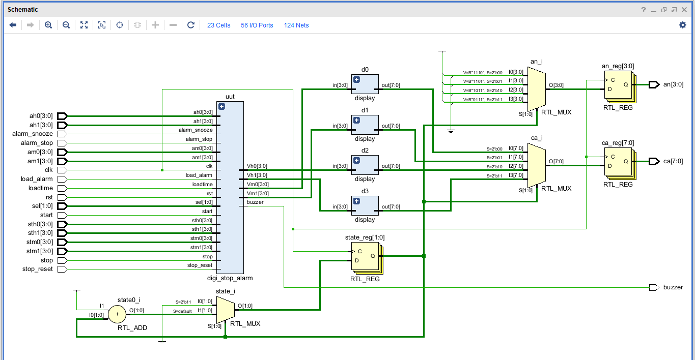
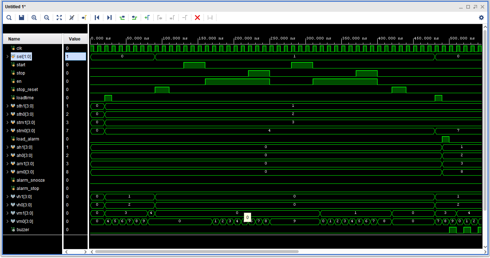
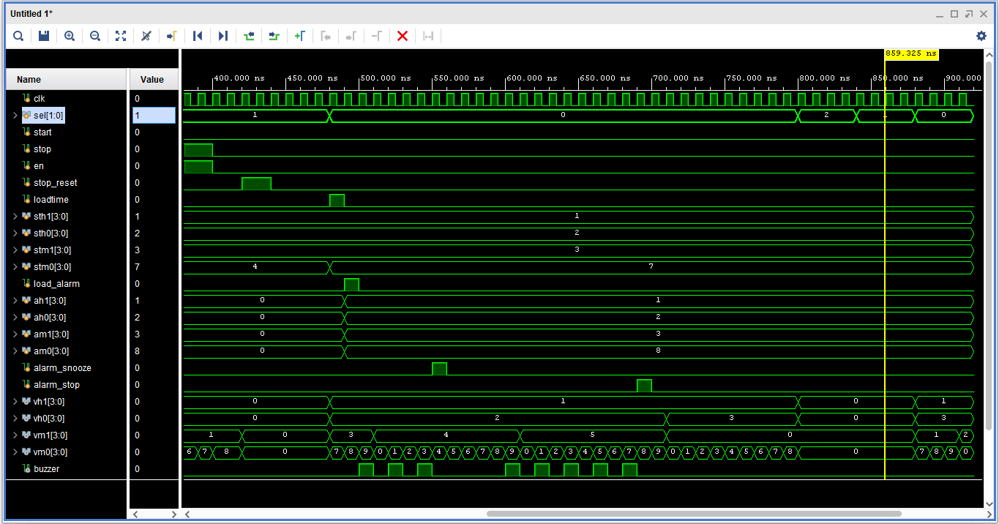
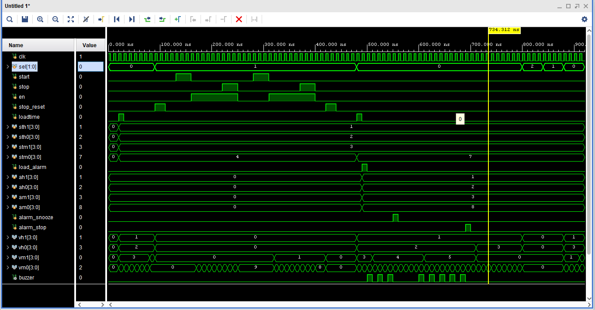

# Integrated Digital Timing System

A Verilog HDL-based digital timing system that combines a **24-hour Digital Clock, Stopwatch, and Programmable Alarm** into a single integrated design.

## 🚀 Demo

An interactive HTML5 demonstration of the project is included in the repository.

**[▶ Open Interactive Demo](./index.html)**

The demo provides an interactive view of:

* Digital Clock
* Stopwatch
* Alarm
* Snooze and Stop
* Manual Time Setting
* Seven-Segment Display
* Mode Selection

> The HTML5 demo is a visual representation of the project. The actual digital system is designed using Verilog HDL and verified through simulation.

## 📌 Project Overview

The project integrates multiple timing functions into one digital system using a modular RTL design approach.

The main functions include:

* **Digital Clock** – 24-hour timekeeping with manual time loading
* **Stopwatch** – Start, Stop, Resume, and Reset
* **Alarm** – Programmable alarm with Snooze and Stop
* **Buzzer** – Generates an oscillating signal for the alarm beep
* **Seven-Segment Display** – Displays the selected timing function
* **Top-Level Integration** – Connects all modules into one system

## ⚙️ Features

* 24-hour Digital Clock
* Manual time setting
* Stopwatch with Start, Stop, Resume, and Reset
* Programmable Alarm
* 5-minute Snooze
* Alarm Stop
* Oscillating Buzzer output
* Four-digit multiplexed Seven-Segment Display
* Clock, Stopwatch, and Alarm mode selection
* Modular Verilog RTL design
* Functional verification through simulation

## 🔢 Operating Modes

| `sel` | Mode          |
| ----- | ------------- |
| `00`  | Digital Clock |
| `01`  | Stopwatch     |
| `10`  | Alarm         |

## 📐 RTL Schematic

The RTL schematic shows the integrated digital timing system and the connections between its major functional modules.

## 🧪 Functional Verification

The complete design was verified using a Verilog testbench.

The following functions were tested:

* System reset
* Digital Clock time loading
* Continuous clock operation
* Stopwatch Start
* Stopwatch Stop
* Stopwatch Resume
* Stopwatch Reset
* Alarm time loading
* Alarm triggering
* Buzzer activation
* Alarm Snooze
* Alarm Stop
* Mode selection and display switching

## 📊 Simulation Results

### Digital Clock and Stopwatch

### Alarm and Buzzer

### Integrated System

The simulation results confirm the correct functional operation and integration of the major modules.

## 🛠️ Tools Used

* **Verilog HDL**
* **Xilinx Vivado**
* **ModelSim**
* **HTML5** – Interactive project demonstration

## 🔮 Future Scope

* Real-Time Clock (RTC) integration
* Multiple programmable alarms
* Keypad-based control
* Date and day display
* Wireless control
* FPGA hardware implementation

## 📌 Conclusion

The Integrated Digital Timing System demonstrates the design and integration of multiple timing functions using Verilog HDL. The project provides practical experience in **RTL design, module integration, control logic, seven-segment display multiplexing, and functional verification**.
